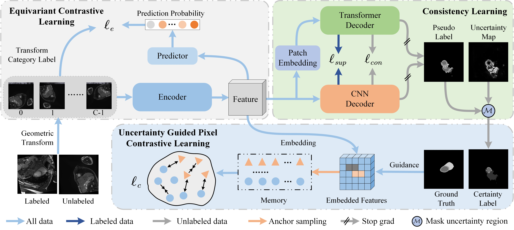
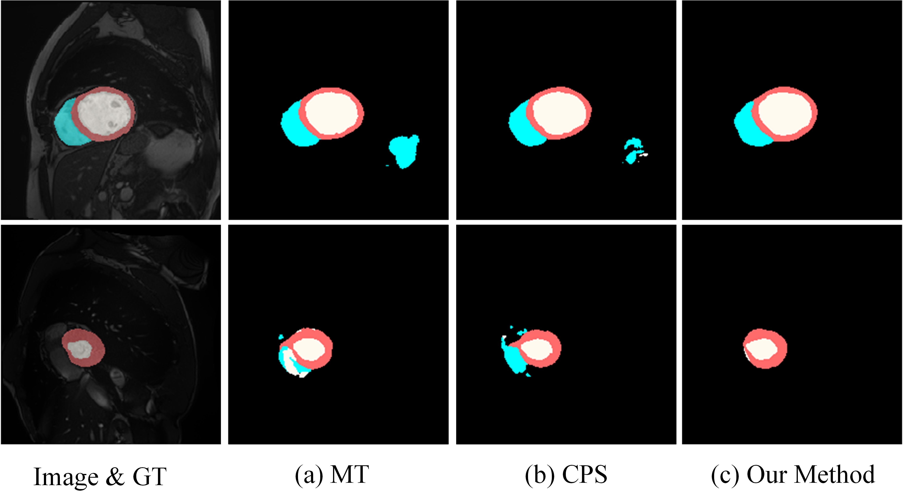
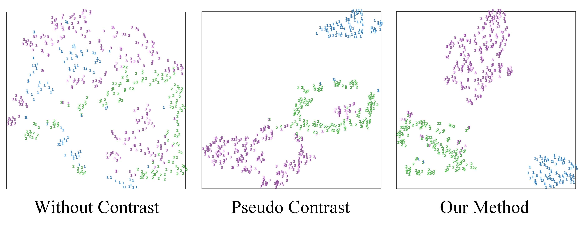

# UGPCL

> [IJCAI' 22] Uncertainty-Guided Pixel Contrastive Learning for Semi-Supervised Medical Image Segmentation.
> 
> Tao Wang, Jianglin Lu, Zhihui Lai, Jiajun Wen and Heng Kong



# Installation
Please refer to [requirements.txt](requirements.txt)

# Dataset
*ACDC* dataset can be found in this [Link](https://github.com/HiLab-git/SSL4MIS/tree/master/data/ACDC).

Please change the dataset root directory in _configs/\_datasets/acdc_224.yaml_.

# Results

### *ACDC* (136 labels):

|    Method    |  Model   | Iterations | Batch Size | Label Size |  DsC  |                             Ckpt                             |                     Config File                     |
| :----------: | :------: | :--------: | :--------: | :--------: | :---: | :----------------------------------------------------------: | :-------------------------------------------------: |
| Mean Teacher | UNet-R50 |    6000    |     16     |     8      | 88.11 | [Link](https://drive.google.com/file/d/1mWKKoeZbSlf6DNxqnoypr50ialPMqFYL/view?usp=sharing) |  configs/comparison_acdc_224_136/mt_unet_r50.yaml   |
|    UGPCL     | UNet-R50 |    6000    |     16     |     8      | 85.75 | [Link](https://drive.google.com/file/d/1T8T6g_xiJWGetQhZeFMNG2q7dzmYyN4s/view?usp=sharing) | configs/comparison_acdc_224_136/ugpcl_unet_r50.yaml |

### Visualization

- Segmentation results:

  

- Pixel features (t-SNE):

  


# Reference
- [https://github.com/HiLab-git/SSL4MIS](https://github.com/HiLab-git/SSL4MIS)
- [https://github.com/tfzhou/ContrastiveSeg](https://github.com/tfzhou/ContrastiveSeg)

# Citation
```bibtex


```
